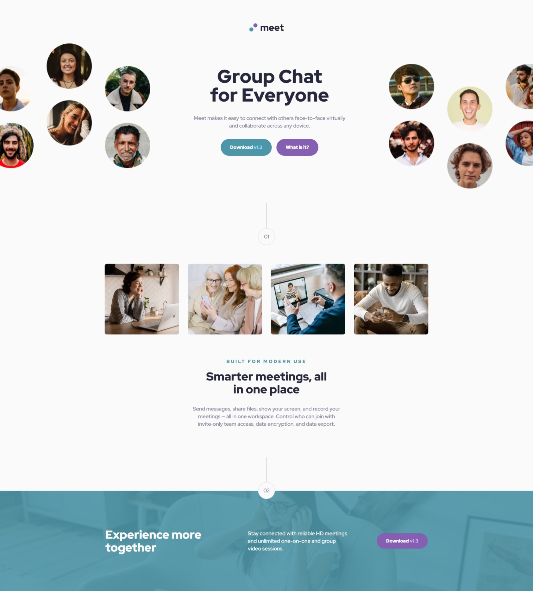

# Frontend Mentor - Meet landing page solution

This is a solution to the [Meet landing page challenge on Frontend Mentor](https://www.frontendmentor.io/challenges/meet-landing-page-rbTDS6OUR). Frontend Mentor challenges help you improve your coding skills by building realistic projects.

## Table of contents

- [Overview](#overview)
    - [The challenge](#the-challenge)
    - [Screenshot](#screenshot)
    - [Links](#links)
- [My process](#my-process)
    - [Built with](#built-with)
    - [What I learned](#what-i-learned)
- [Author](#author)

## Overview

### The challenge

Users should be able to:

- View the optimal layout depending on their device's screen size
- See hover states for interactive elements

### Screenshot



### Links

- Solution URL: [Frontend Mentor Solution Page](https://www.frontendmentor.io/solutions/clever-landing-page-challenge-w-offset-hero-images-full-solution-r-yBpn5rEk)
- Live Site URL: [Hosted on GitHub Pages](https://aleknovkovski.github.io/FEM-meet-landing-page/working/)

## My process

### Built with

- Semantic HTML5 markup
- CSS custom properties
- Flexbox

### What I learned

I learned not to give up when it seems like a given design cannot be made to look good at bigger sizes.

The problem: The design involves a hero area where there is a content area in the middle, an image to the left of it, and an image to the right of it. Those images stick to the edges of the screen. To make things even more difficult, the images fall of the edges of the screen a little.

Now, it is easy to recreate this design at the exact-size as the figma file (1440px). 
However, at bigger screen-sizes it starts to fall apart if you keep the side-images on the edges of the screen. They start going too far from the middle area, and you're left with huge gaping whitespace. Doesn't look good.

#### How I solved this:

At the default (1440-based design) the effect is achieved by placing all 3 items (left image, content, right image) in a flexbox where they are spaced apart, so the images end up at the edges of the screen. You can then use offset positioning to push them slightly off the edge of the screen.

This looks decent at this screen size as the images and the content area are similar in size, so there isn't too much whitespace between the images and the content area in the middle.

I then proceed to find a way to keep this look even if the screen grows somewhat. To achieve this I sized the images using percentages. So for the first desktop breakpoint (1440-> 1600 range) I did this:

```css
.hero-image-right {
    width: 35%;
}
```

And for the larger screens (1600-> 1920) I lowered the percentage like so:

```css
.hero-image-right {
    width: 30%;
}
```

And finally for super-large-screens I also changed the alignment of the images so they don't stick to the edges of the screen. So the code at the 1920 breakpoint looks like this:

```css
@media screen and (min-width: 1920px) {
    
    .hero {
    justify-content: center;
    }

    .hero-image-left {
        width: 20%;
    }

    .hero-image-right {
        width: 20%;
    }
}
```

This is a good solution where the design is kept at different sizes as well. In fact, if you zoom in and out of the 1920 breakpoint range you'll notice it looks consistent. The 1920+ version looks like a zooomed-out version of the same design.
## Author

- Frontend Mentor - [@aleknovkovski](https://www.frontendmentor.io/profile/aleknovkovski)
- Linkedin - [@aleknovkovski](https://www.linkedin.com/in/aleknovkovski/)
